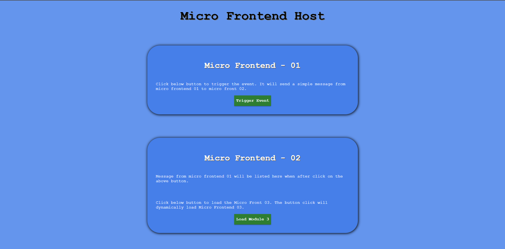
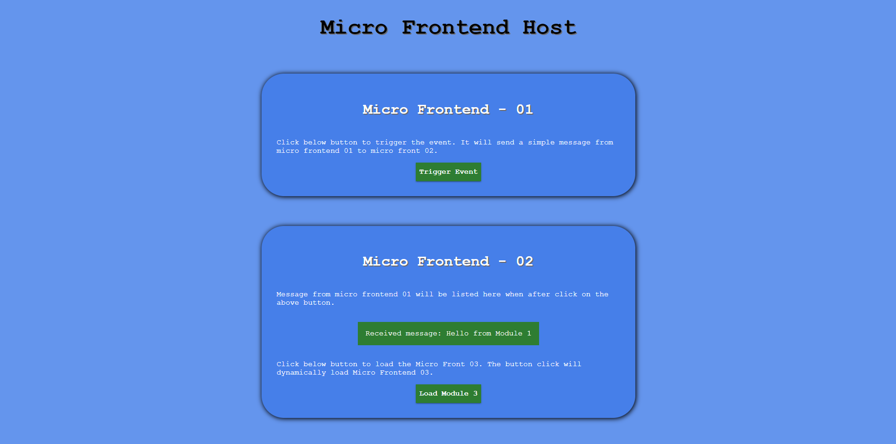
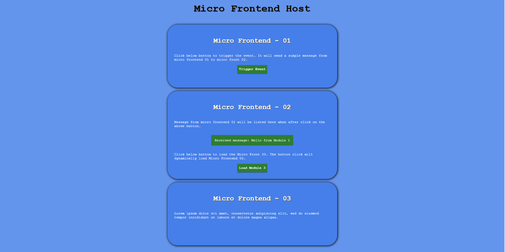

# Micro Frontend with HTML and WebPack

Simple micro frontend POC application with HTML and CSS with WebPack.

## Setup Instructions
1. Run ``` npm install ```
2. Run ``` npm run dev ```

## Screens




